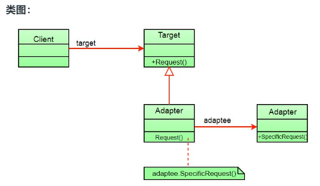
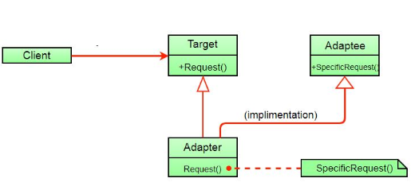

# 适配器模式

[适配器模式](https://www.geeksforgeeks.org/adapter-pattern/)

这种模式很容易理解，因为现实世界充满了适配器。例如，考虑一个 USB 到以太网适配器。当我们一端有以太网接口，另一端有 USB 时，我们需要这个。因为它们彼此不兼容。我们使用将一个转换为另一个的适配器。这个例子非常类似于面向对象的适配器。在设计中，当我们有一个类（客户端）需要某种类型的对象，并且我们有一个对象（Adaptee）提供相同的功能但公开不同的接口时，就会使用适配器。

要使用适配器：

1. 客户端通过使用目标接口调用适配器上的方法向适配器发出请求。
2. 适配器使用适配器接口在适配器上转换该请求。
3. 客户端收到调用的结果并且不知道适配器的存在。



客户端只看到目标接口而不是适配器。适配器实现目标接口。Adapter 将所有请求委托给 Adaptee。

**例子：**

假设您有一个带有 fly() 和 makeSound() 方法的 Bird 类。还有一个带有 squeak() 方法的 ToyDuck 类。假设您缺少 ToyDuck 对象，并且您想使用 Bird 对象代替它们。Birds 有一些类似的功能，但实现了不同的接口，所以我们不能直接使用它们。所以我们将使用适配器模式。在这里，我们的客户是 ToyDuck，Adaptee 是 Bird。

下面是它的Java实现。

```java
// Java implementation of Adapter pattern

interface Bird {
    // birds implement Bird interface that allows
    // them to fly and make sounds adaptee interface
    public void fly();

    public void makeSound();
}
class Sparrow implements Bird {
    // a concrete implementation of bird
    @Override
    public void fly() {
        System.out.println("Flying");
    }

    @Override
    public void makeSound() {
        System.out.println("Chirp Chirp");
    }
}
interface ToyDuck {
    // target interface
    // toyducks dont fly they just make
    // squeaking sound
    public void squeak();
}
class PlasticToyDuck implements ToyDuck {
    @Override
    public void squeak() {
        System.out.println("Squeak");
    }
}
class BirdAdapter implements ToyDuck {
    // You need to implement the interface your
    // client expects to use.
    Bird bird;

    public BirdAdapter(Bird bird) {
        // we need reference to the object we
        // are adapting
        this.bird = bird;
    }

    @Override
    public void squeak() {
        // translate the methods appropriately
        bird.makeSound();
    }
}
class Main {
    public static void main(String[] args) {
        Sparrow sparrow = new Sparrow();
        ToyDuck toyDuck = new PlasticToyDuck();

        // Wrap a bird in a birdAdapter so that it
        // behaves like toy duck
        ToyDuck birdAdapter = new BirdAdapter(sparrow);

        System.out.println("Sparrow...");
        sparrow.fly();
        sparrow.makeSound();

        System.out.println("ToyDuck...");
        toyDuck.squeak();

        // toy duck behaving like a bird
        System.out.println("BirdAdapter...");
        birdAdapter.squeak();
    }
}
```

输出：

```
Sparrow...
Flying
Chirp Chirp
ToyDuck...
Squeak
BirdAdapter...
Chirp Chirp
```

**解释：**
假设我们有一只可以发出声音（）的鸟，我们有一只可以发出吱吱声（）的塑料玩具鸭。现在假设我们的客户改变了要求，他希望 toyDuck 发出比 ?

简单的解决方案是我们只需将实现类更改为新的适配器类，并告诉客户端将鸟的实例（它想要 squeak()）传递给该类。

**之前：** ToyDuck toyDuck = new PlasticToyDuck();
**之后：** ToyDuck toyDuck = new BirdAdapter(sparrow);

您可以看到，只需更改一行，toyDuck 现在就可以发出唧唧喳喳了！

**对象适配器与类适配器**

我们上面实现的适配器模式被称为对象适配器模式，因为适配器拥有一个被适配者的实例。还有另一种称为类适配器模式的类型，它使用继承而不是组合，但您需要多重继承来实现它。

Class Adapter Pattern的类图：



这里不是在适配器（组合）中使用适配器对象来利用其功能，适配器继承了适配器。

由于包括 java 在内的许多语言不支持多重继承并且与许多问题相关联，我们没有展示使用类适配器模式的实现。

**优点：**

- 有助于实现可重用性和灵活性。
- 客户端类并不因为必须使用不同的接口而变得复杂，并且可以使用多态性在适配器的不同实现之间进行交换。

**缺点：**

- 所有请求都被转发，因此开销略有增加。
- 有时需要沿着适配器链进行许多调整才能达到所需的类型。