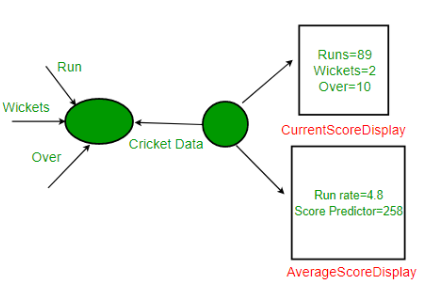
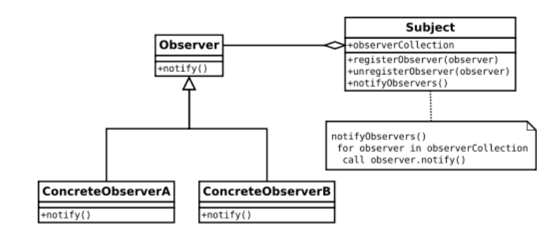
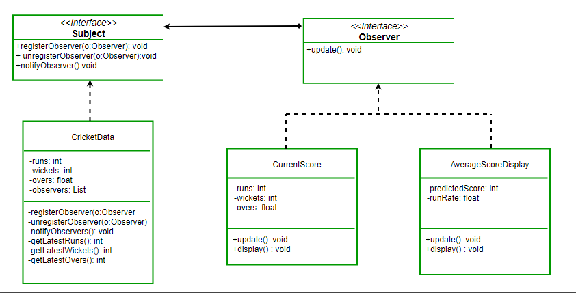

[Observer Pattern | Set 1 (Introduction) - GeeksforGeeks](https://www.geeksforgeeks.org/observer-pattern-set-1-introduction/)

**场景**：

假设我们正在构建一个板球应用程序，用于通知观众当前得分、跑步率等信息。假设我们制作了两个显示元素 CurrentScoreDisplay 和 AverageScoreDisplay。CricketData 拥有所有数据（跑步、保龄球等），每当数据更改时，显示元素都会收到新数据通知，并相应地显示最新数据。

## 观察者模式

### 类图

**什么时候使用这种模式？**
当多个对象依赖于一个对象的状态时，您应该考虑在应用程序中使用此模式，因为它为同一对象提供了简洁且经过良好测试的设计。

**现实生活中的用途：**

- 它在 GUI 工具包和事件监听器中大量使用。在 java 中，button(subject) 和 onClickListener(observer) 是用观察者模式建模的。
- 社交媒体、RSS 提要、电子邮件订阅，您可以选择关注或订阅并收到最新通知。
- 如果有更新，Play 商店中应用程序的所有用户都会收到通知。

### 使用观察者模式改造上述案例

